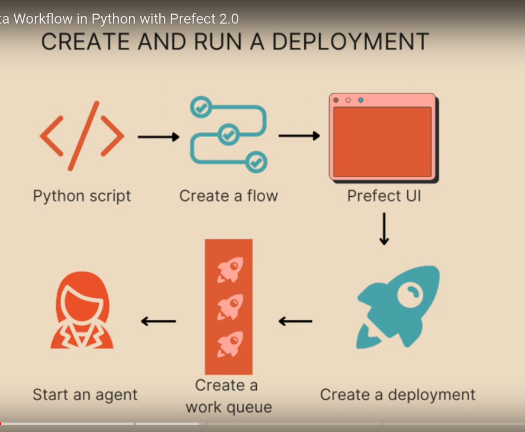

# Prefect (workflow orchestration)

## Intro

> Prefect is used for adding functionalities to your data-piplines and automating **work-flows**


Data Pipelines need 

    scheduling
    retries
    logging
    caching
    notifications
    observability


Prefect is made up of flows and tasks !! 

### **Flow** (& subflows)
> **Sequence of individual parts** of data-pipeline which we need to run (and get functionality for)
> Function that does many tasks

```python3
from prefect import flow

@flow
def my_favorite_function():
    print("What is your favorite number?")
    return 42

print(my_favorite_function())

```
### **Task**
> Individual (function) work executed within flows


Unit function/step in flow; adding them is helpful for 
1. Cashing outputs of tasks (saving time/downloads)
2. Observability (via Prefect UI)
3. easier Debugging (via Prefect UI)
4. Better Logging (via Prefect UI)
5. Option for Concuruncy (serial and parallel executions)
6. Retries on failure 

Converting functions inside flows to task

```python3
import requests
from prefect import flow, task

@task
def call_api(url):
    response = requests.get(url)
    print(response.status_code)
    return response.json()

@flow
def api_flow(url):
    fact_json = call_api(url)
    return fact_json

print(api_flow("https://catfact.ninja/fact"))
```


Subflows over tasks (when?)
> When you want to group tasks together

Caching of task outputs 

```python3
@task(cache_key_fn=task_input_hash, cache_expiration=timedelta(days=1))
def my_task():
   return "hello"
```

Retry tasks on failure 

```python3
@task(retries, retries_delay_seconds)
```

### Prefect UI

[Documentation](https://docs.prefect.io/ui/overview/)


The following sections provide details about Prefect UI pages and visualizations:

* Flow Runs page provides a high-level overview of your flow runs.
* Flows provides an overview of specific flows tracked by by the API.
* Deployments provides an overview of flow deployments that you've created on the API.
* Work Queues enable you to create and manage work queues that distribute flow runs to agents.
* Blocks enable you to create and manage configuration for blocks such as storage.
* Notifications enable you to create and manage alerts based on flow run states and tags.
* Task Run Concurrency Limits enable you to restrict the number of certain tasks that can run simultaneously.

**Starting UI** 

```
$ prefect orion start
Starting...

 ___ ___ ___ ___ ___ ___ _____    ___  ___ ___ ___  _  _
| _ \ _ \ __| __| __/ __|_   _|  / _ \| _ \_ _/ _ \| \| |
|  _/   / _|| _|| _| (__  | |   | (_) |   /| | (_) | .` |
|_| |_|_\___|_| |___\___| |_|    \___/|_|_\___\___/|_|\_|

Configure Prefect to communicate with the server with:

    prefect config set PREFECT_API_URL=http://127.0.0.1:4200/api

Check out the dashboard at http://127.0.0.1:4200

```


**Deployment** [READ MORE ABOUT IT]

Deploying flows on server for automated runs, continued reruns; 

Creating using CLI 

```bash
(de-week-2) paramm@paramm-X556UQK:~/projects/test/DE-Zoomcamp-HW-2023$ prefect deployment build Week_2/from_github.py:etl_web_to_gcs -n week2-de-deploy-github -q test
Found flow 'etl-web-to-gcs'
Default '.prefectignore' file written to /home/param/projects/test/DE-Zoomcamp-HW-2023/.prefectignore
Deployment YAML created at '/home/param/projects/test/DE-Zoomcamp-HW-2023/etl_web_to_gcs-deployment.yaml'.
Deployment storage None does not have upload capabilities; no files uploaded.  Pass --skip-upload to suppress this warning.

```

Building from a github repo 

```
prefect deployment build Week_2/from_github.py:etl_web_to_gcs -n week2-de-deploy-github -q test

prefect deployment build Week_2/from_github.py:etl_web_to_gcs -n week2-de-deploy-github -q test -sb github/dev -a
```


Apply (to see it in UI)

```bash
prefect deployment apply ${yml_file_generated}
# example: 
prefect deployment apply etl_gcs_to_bq-deployment.yaml 
```


Start agent to execute runs 

```bash
prefect agent start -q 'test'
```

**Scheduling data work-flows**


* running scripts between time
 Using deployments 