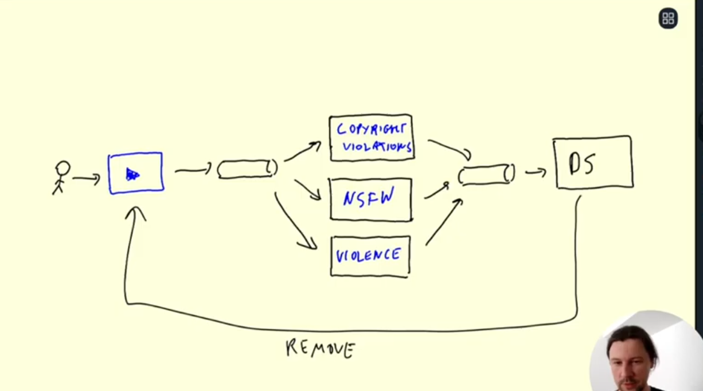

# MLOps 

## Introduction 

1. Building Data-Science models to experiment
   1. Jupyter-notebooks good for experimentation
   2. Bad for tracking & reproducing results 
2. Components of Jupyter-notebooks that can be improved
   1. Experiment tracking and model registery
      1. Storing various experiments we do along with models and various hyper-parameters used to store that model
   2. ML Pipelines 
      1. Storing steps to   
         1. Pre-process data 
         2. Generate features 
         3. Clean Features 
      2. For better ML-modelling 
   3. ML Deployment 
      1. Building services or APIs that could use ML Models for real-time prediction 
         1. i.e Adding ML to Products 

   4. Model Monitoring 
      1. API's and UI's to check real-tiome performance of the models and to check if Key Performance Index's (KPIs) of the product are meet. 

      2. [Optional] Automated Re-deployment of models  

[**Maturity-level of models by microsoft**](https://learn.microsoft.com/en-us/azure/architecture/example-scenario/mlops/mlops-maturity-model)

| Level  | 	Description  | Highlights  | Technology |
| :---: | :---: | :---: | :---: |
| 0 |	No MLOps | Difficult to manage full machine learning model lifecycle The teams are disparate and releases are painful Most systems exist as "black boxes," little feedback during/post deployment | Manual builds and deployments Manual testing of model and application No centralized tracking of model performance Training of model is manual |
| 1 |	DevOps but no MLOps | Releases are less painful than No MLOps, but rely on Data Team for every new model Still limited feedback on how well a model performs in production ; Difficult to trace/reproduce results | Automated builds Automated tests for application code|
| 2 |	Automated Training 	|    Training environment is fully managed and traceable ; Easy to reproduce model Releases are manual, but low friction | Automated model training Centralized tracking of model training performance ; Model management|
| 3 | Automated Model Deployment 	| Releases are low friction and automatic ; Full traceability from deployment back to original data ; Entire environment managed: train > test > production | Integrated A/B testing of model performance for deployment     ;Automated tests for all code ;Centralized tracking of model training performance |
| 4 | Full MLOps Automated Operations | Full system automated and easily monitored; Production systems are providing information on how to improve and, in some cases, automatically improve with new models; Approaching a zero-downtime system | Automated model training and testing; Verbose, centralized metrics from deployed model | 

## Experiment tracking 

MLFlow 

Used for experiment tracking and model tracking 

* Experiment tracking using UI 
* Model (& related files) tracking

Model (& related files) tracking

* This can be done via UI using register model button

For this to work 

> Before you can add a model to the Model Registry, you must log it using the log_model methods of the corresponding model flavors. 

2 Workflows to register/update (etc) models for different tasks 

[1] UI using register button 
[2] API calls

## Orchestration and ML Pipelines

Model performance decays over time; 

Ocestration and Prefect 

-> Ocestration: 
	* orchestration workflow, which is based on Business Process Manager Business Process Definition, defines a logical flow of activities or tasks from a Start event to an End event to accomplish a specific service. 
	* Machine learning orchestration tools are used to automate and manage workflows and pipeline infrastructure, with a simple, collaborative interface.

	* **This helps with scheduled training and monitoring of this scheduled training**

## Model deployment 

There are 3 ways in which machine learning models can be deployed 

1. Offline mode (aka batch mode) (aka on demand prediciton)
2. Online mode (for real-time prediction)
   1. Deploying via Web-apps (like a client server model)
   2. Deploying a Producer-consumer app;
3. Deploying models on Edge; (on Device Computing)

[*Note: Blog refering above*](https://towardsdatascience.com/3-ways-to-deploy-machine-learning-models-in-production-cdba15b00e)
[batch-inference-vs-online-inference](https://mlinproduction.com/batch-inference-vs-online-inference/)

### Batch Inference 

(aka offline mode of prediction)
> Generally used when real-time predictions of product is not required.

* Batch inference, or offline inference, is the process of generating predictions on a batch of observations. 
* **The batch jobs are typically generated on some recurring schedule** (e.g. hourly, daily). These predictions are then stored in a database and can be made available to developers or end users.
* [ADVANTAGE] infrastructure requirements for batch inference are still simpler than those for online inference.

**Usage**

1. For marketing related tasks; (running and predicting daily/weekly)
2. Stock market (hourly/nightly job analysis), news sentiment analysis

### Online prediction 

> Generally used when real-time predictions of product is required.

**MODEL IS UP AND RUNNING ALL THE TIME**

#### Web-apps 

* Online Inference is the process of generating machine learning predictions in real time upon request.
* Online inference allows us to take advantage of machine learning models in real time. 
* One to one relationship (i.e answer is expected for each request)

Getting data and sending predictions via HTTP requests (back to backend)

**Challenges**

Meet latency & up-time requirements
   1. Service needs to be up and ready to serve requests 24/7
   2. Service needs to return reply of requests in required ms 

**Examples**
1. Real-time price/rate prediction. 

#### Streaming apps 

### Edge-device deployment
> Deploying models on edge devices (example: phones; servers; IoT devices; etc)

If the Machine and deep learning models are not deployed directly at the edge devices, these smart devices will have to offload the intelligence to the cloud. In the absence of a good network connection and bandwidth, it can be a quite a costly affair. 

* One to many relationship or many to many relationship
* Answer is not expected and answer could also push events into pipeline
  * i.e no explicit relationship between producer and consumer

example: Content moderation system for youtube 

Advantage 

1. Reduced latency issues 
2. Availibilty (in this case internet connection is not required)
3. Reduced data-bandwidth consumption
4. Tensorflow lite supports Android, iOS, and Linux (Including Raspberry Pi).

Challenges 

1. Size & complexity of models

## Best Practices

## Resources
PFA section-wise various recources which can be used to revisit concepts. 

### Courses 

- [MLOps-zoomcamp](https://github.com/DataTalksClub/mlops-zoomcamp#syllabus)
- [ML-Zoomcamp playlist](https://github.com/alexeygrigorev/mlbookcamp-code/tree/master/course-zoomcamp)

### Videos 

### Blogs 

* [Machine learning model deployment](https://towardsdatascience.com/3-ways-to-deploy-machine-learning-models-in-production-cdba15b00e)
* [Deploying large scale deep learning models](https://towardsdatascience.com/3-ways-to-deploy-machine-learning-models-in-production-cdba15b00e)
* [batch-inference-vs-online-inference](https://mlinproduction.com/batch-inference-vs-online-inference/)
* [Edge-computing-and-deployment](https://www.lfedge.org/2022/04/28/deep-learning-models-deployment-with-edge-computing/)
* [Example: Deploying AI model as edge computing model](https://towardsdatascience.com/how-to-deploy-your-ai-model-on-edge-devices-8c38a9519c58)

  
### Books

